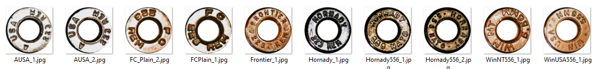
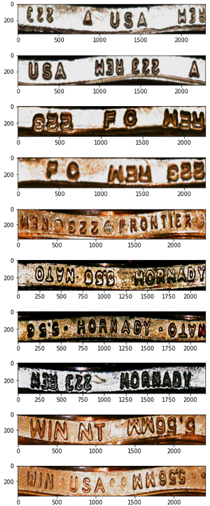
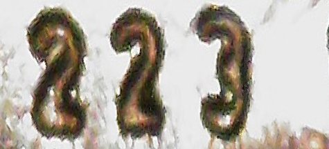
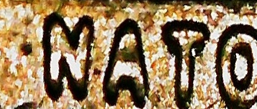
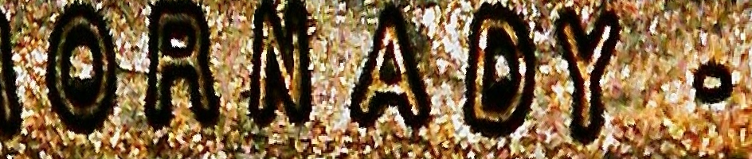
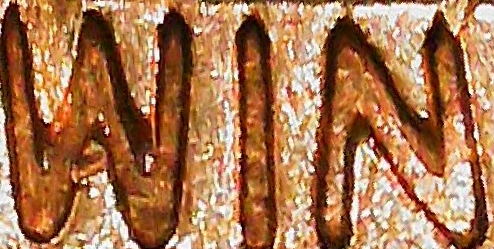
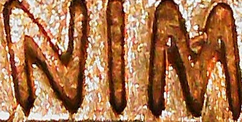
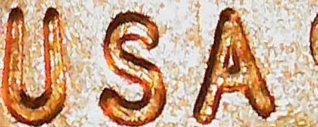
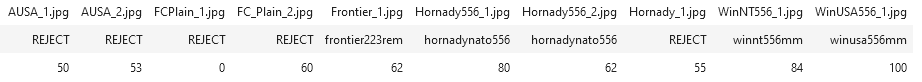

# Text recognition for classifying brass ring images
Andrew Wang

## Get started

1. Put test images in `data/test_images`
2. Install CRAFT text detector with `pip install craft-text-detector` 
3. Download text recognition model `None-ResNet-None-CTC.pth` model from `https://github.com/clovaai/deep-text-recognition-benchmark#run-demo-with-pretrained-model` into `deep-text-recognition-benchmark`.
4. Install fuzzywuzzy using `pip install fuzzywuzzy`
5. Step through [demo](demo.ipynb).

## Methods

We are given square, centered images of brass rings, such as below:

The following methodology consists of 4 stages:

- Image pre-processing
- Scene text detection
- Scene text recognition
- Word matching

First warp image from polar coordinates to obtain rectangular images. Then detect area of least activity along the rectangle length and wrap rectangle to not cut off any characters. See below for example outputs. Note how some text is upside down.

Then we pass the rectangles through the [CRAFT text detector](https://github.com/fcakyon/craft-text-detector) to give bounding boxes of what the model considers "words". The three thresholds given change how likely characters are to exist and how likely characters are to be grouped into words. See example crops below. Note that there is still arbitrary orientation of the crops. Out of all the stages in the method, CRAFT performs the worst (it should get better once you tune the hyperparameters, although there must be better and faster alternatives out there).

     

  
  
  
  
  
  

Then we pass the crops through the [4-stage scene text recognition pipeline](https://github.com/clovaai/deep-text-recognition-benchmark). We don't need their pre-processing stage nor their corpus likelihood model, since the output text isn't standard English. Then we detect the best orientation for each segment by comparing confidences, and also pass the segments through a hardcoded rulebook - for example, `NIM` should always return `WIN`. We collect these segments into a bag of words for each image.

Finally, we run word matching. For each image, get all permutations of its bag of words, and compare each permutation with all given `classes=["winusa556mm", "winnt556mm", "hornadynato556", "hornady223mm", "frontier223rem", "fc223rem"]` using fuzzy word matching. Keep best match for each image, and for any score that is less than a given threshold, return `REJECT` signifying OOD _or_ failure. See below for an example output dataframe.

where the first row is original filename, second row is class predictions, and third row is the matching score.

### Notes
See inline comments in [demo](demo.ipynb) for notes on inference time.